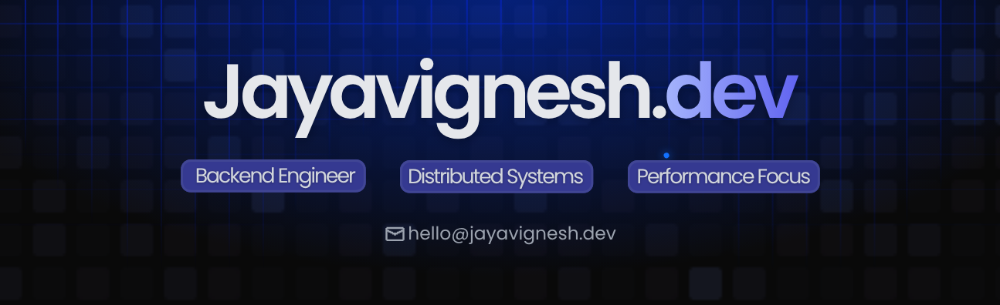

<a href="https://jayavignesh.dev/">
  
</a>

<br/>

[](https://jayavignesh.dev)
<a href="https://linkedin.com/in/i-viki" target="_blank"></a>&thinsp;<a href="mailto:hello@jayavignesh.dev"></a>&thinsp;<a href="https://jayavignesh.dev" target="_blank"></a>

<a href="https://jayavignesh.dev/" target="_blank"></a>

<h3>Building backend systems that <i>scale</i> & <i>survive</i> in production.</h3>

- ⚙️ Java Backend Engineer — Spring Boot · Microservices · Distributed Systems

- 🔬 Currently deep-diving into **Concurrency, JVM Internals & Performance Tuning**

- 🌐 My work → [jayavignesh.dev](https://jayavignesh.dev)

- 🤝 **Open to full-time senior backend roles** — [**hello@jayavignesh.dev**](mailto:hello@jayavignesh.dev)

<br/>

 &ensp; <b>Tech Stack</b>
<br>

<table>
  <tr>
    <td valign="top" width="50%">

<br/>


<br/>


<br/>


</td>
    <td valign="top" width="50%">

<br/>


<br/>


<br/>


</td>
  </tr>
</table>

📈<b> Contribution Graph</b>

[](https://jayavignesh.dev)

<div align="center">
  <picture>
    <source media="(prefers-color-scheme: dark)" srcset="https://raw.githubusercontent.com/i-viki/i-viki/output/github-snake-dark.svg">
    <source media="(prefers-color-scheme: light)" srcset="https://raw.githubusercontent.com/i-viki/i-viki/output/github-snake.svg">
    
  </picture>
</div>


<br/>

<details>
  <summary>
     &ensp;
    <b>Stats Overview</b>


  </summary>

   

  <div align="center">
    <a href="https://jayavignesh.dev">
      
    </a>
    <a href="https://jayavignesh.dev">
      
    </a>
    <br/>
    <a href="https://jayavignesh.dev">
      
    </a>
  </div>

  <br/>

  <p align="center">
    <br/>
    <b>📊 Weekly Development Breakdown</b>
  </p>

  <!--START_SECTION:waka-->


**🐱 My GitHub Data** 

> 📦 50.0 kB Used in GitHub's Storage 
 > 
> 🏆 262 Contributions in the Year 2026
 > 
> 🚫 Not Opted to Hire
 > 
> 📜 13 Public Repositories 
 > 
> 🔑 3 Private Repositories 
 > 
📊 **This Week I Spent My Time On** 

```text
💬 Programming Languages: 
CSS                      12 mins             ███████████████████░░░░░░   75.60 % 
JavaScript               3 mins              ██████░░░░░░░░░░░░░░░░░░░   24.40 % 
```

**I Mostly Code in Java** 

```text
Java                     5 repos             ████████░░░░░░░░░░░░░░░░░   33.33 % 
JavaScript               4 repos             ███████░░░░░░░░░░░░░░░░░░   26.67 % 
CSS                      2 repos             ███░░░░░░░░░░░░░░░░░░░░░░   13.33 % 
C                        1 repo              ██░░░░░░░░░░░░░░░░░░░░░░░   06.67 % 
Jupyter Notebook         1 repo              ██░░░░░░░░░░░░░░░░░░░░░░░   06.67 % 
```


 Last Updated on 23/06/2026 20:30:49 UTC
<!--END_SECTION:waka-->

</details>


<br/>
<!-- updated -->
<!-- v2 -->
